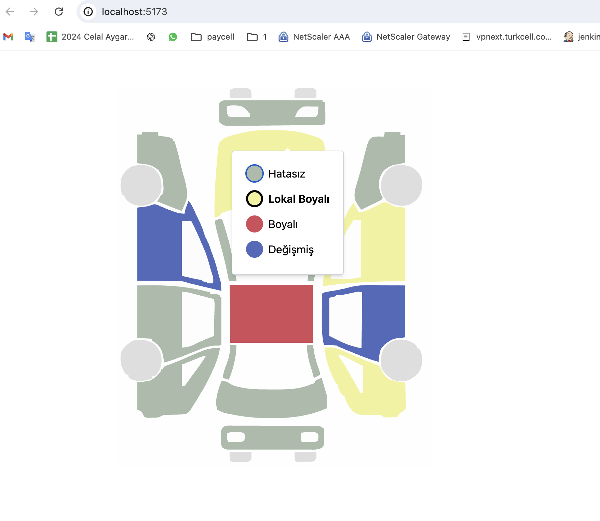

# React Car Color Customizer

This project is a React-based car customization application using **Vite**, **TypeScript**, **Tailwind CSS**, and **Material-UI (MUI)**. The application allows users to select car body parts from an SVG image and assign colors to them. Each color corresponds to a specific status (`partChangeStatus`), and the resulting configuration is displayed in JSON format.

---

## Table of Contents

- [Setup Instructions](#setup-instructions)
- [Functionality Overview](#functionality-overview)
- [Car Body Parts JSON Example](#car-body-parts-json-example)
- [Technologies Used](#technologies-used)

---

## Setup Instructions

Follow the steps below to set up and run the project:

1. **Clone the Repository:**
   ```bash
   git clone <repository-url>
   cd <repository-folder>

2. **Install Dependencies: Make sure you have Node.js installed. Run:**
   ```bash
   npm install

3. **Run the Development Server: Start the application in development mode:**
   ```bash
   npm run dev

4. **Build for Production: To create a production-ready build:**
   ```bash
   npm run build

5. **Preview Production Build: To preview the production build:**
   ```bash
   npm run preview

**Functionality Overview

1. **Car Body Parts Visualization:**
   The application displays an SVG representation of a car. Each part (e.g., doors, roof, bumpers) is clickable.

2. **Color Assignment:**
- Users can select a body part and assign one of the following colors:
  - Red (#FF0000) - CHANGED
  - Blue (#0080FF) - PAINTED
  - Yellow (#FFFF30) - LOCALLY_PAINTED
  - Gray (#AABBAB) - DEFECT_FREE
- After assigning a color, the partChangeStatus for the selected part will update accordingly.

2. **Resulting JSON:**
The current configuration of the car (parts and their colors/statuses) is displayed as a JSON object. This JSON can be used for further processing or saved for later use.


## Car Body Parts JSON Example

Below is an example of the JSON output after customizing the car parts:
```
{
  "FRONT": {
    "color": "#d44c5a",
    "partChangeStatus": "PAINTED"
  },
  "REAR": {
    "color": "#516abd",
    "partChangeStatus": "CHANGED"
  },
  "RIGHT_FRONT_DOOR": {
    "color": "#f2f29b",
    "partChangeStatus": "LOCALLY_PAINTED"
  },
  "LEFT_FRONT_DOOR": {
    "color": "#AABBAB",
    "partChangeStatus": "DEFECT_FREE"
  },
  "RIGHT_REAR_DOOR": {
    "color": "#d44c5a",
    "partChangeStatus": "PAINTED"
  },
  "LEFT_REAR_DOOR": {
    "color": "#BBCCBC",
    "partChangeStatus": "CHANGED"
  },
  "ROOF": {
    "color": "#f2f29b",
    "partChangeStatus": "LOCALLY_PAINTED"
  },
  "RIGHT_FRONT_FENDER": {
    "color": "#516abd",
    "partChangeStatus": "CHANGED"
  },
  "LEFT_FRONT_FENDER": {
    "color": "#AABBAB",
    "partChangeStatus": "DEFECT_FREE"
  },
  "RIGHT_REAR_FENDER": {
    "color": "#BBCCBC",
    "partChangeStatus": "DEFECT_FREE"
  },
  "LEFT_REAR_FENDER": {
    "color": "#f2f29b",
    "partChangeStatus": "LOCALLY_PAINTED"
  },
  "FRONT_BUMPER": {
    "color": "#516abd",
    "partChangeStatus": "CHANGED"
  },
  "REAR_BUMPER": {
    "color": "#d44c5a",
    "partChangeStatus": "PAINTED"
  }
}
```
## Technologies Used
- Vite: Lightning-fast frontend build tool.
- React: For building interactive user interfaces.
- TypeScript: For type safety and maintainability.
- Tailwind CSS: For utility-first styling.
- Material-UI (MUI): For pre-styled, customizable React components.
